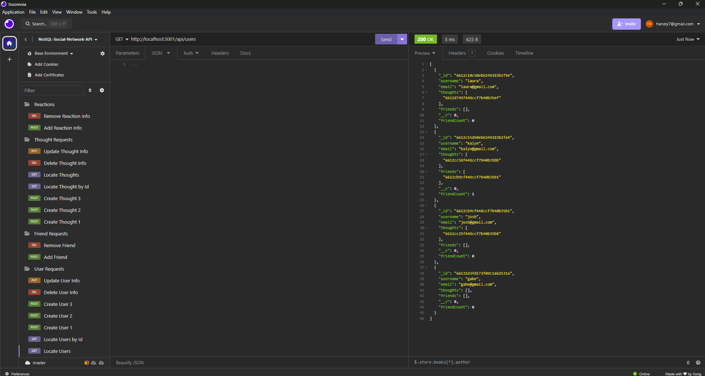
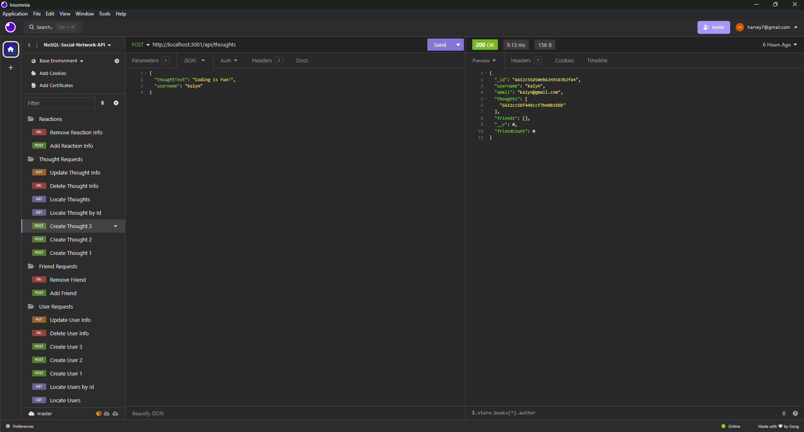
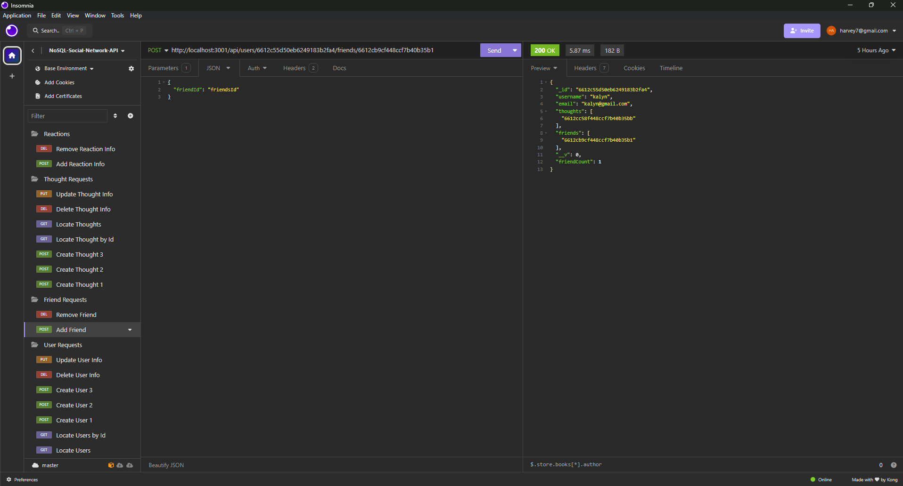
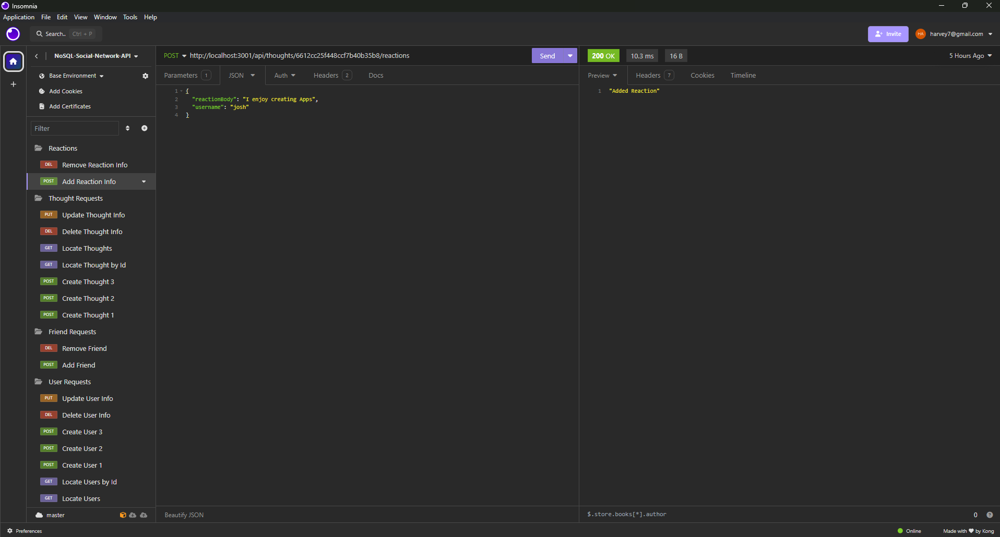

# NoSQL-Social-Network-API

## Table of Contents

* [Description](#description)
* [Installation](#installation)
* [Usage](#usage)
* [Credits](#credits)
* [Screenshots](#screenshots)
* [Video](#video)
* [Link to Website](#link-to-website)
* [License](#license)

## Description

This application is a social network API that allows a social media company to store data using a NoSQL database. This will provide the social media company the ability to store a large amount of unstructured data. This application will handle Create, Read, Update, and Delete (CRUD) requests for Users and Thoughts. This application will also handle Add and Remove requests for Friend Requests and Reactions to Thoughts.

## Installation

In order to utilize this Social Network API, the user will first need to clone the repository. MongoDB, Compass and Insomnia will also need to be installed in order to interact with the database. While in the root directory, the user will then need to type `npm i` in the CLI to install dependencies. Next, the user will need to enter the command `npm start` in order to activate the server and connect to the MongoDB database.

## Usage

After installation procedures are completed, the user will need to open Insomnia to perform all CRUD operations.

## Credits

Project Done in collaboration with coding students Kalyn Sifuentes, Joshua Hale, and Angela Cortes.

YouTube Channel Accessed for Function Guidance: https://www.youtube.com/@thoscalle by Thomas Calle

Tutor Assistance provided by Abduraghmaan Gabriels.

## Screenshots

Insomnia Users Screenshot:

Insomnia Thought Request Screenshot:

Insomnia Friend Request Screenshot:

Insomnia Reactions Screenshot:

## Video

Insomnia Demonstration Video:

https://drive.google.com/file/d/1Uv7ECXCAgc3cIQD0d3DJufi1sL1O9zEe/view

## Link to Website

N/A

## License

This application is licensed under the Apache 2.0 License.

https://opensource.org/licenses/Apache-2.0